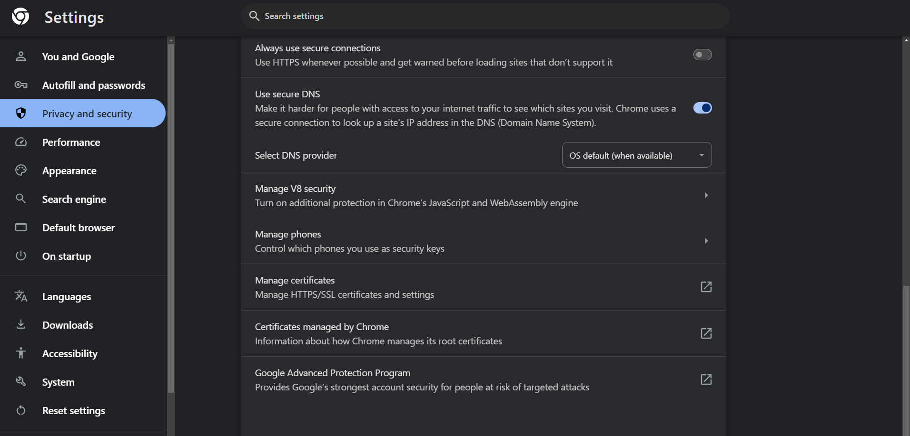
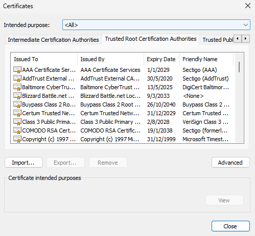
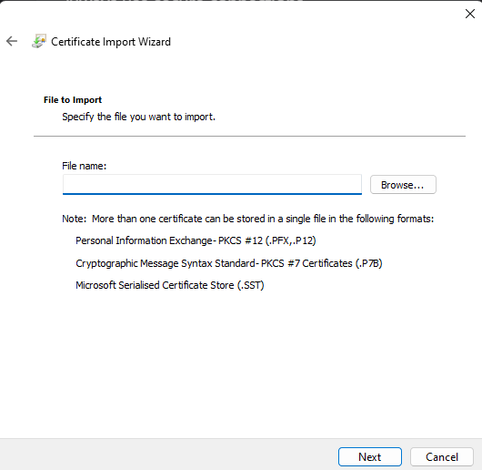
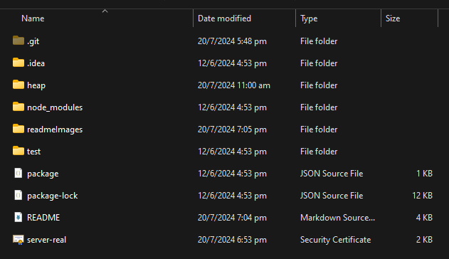
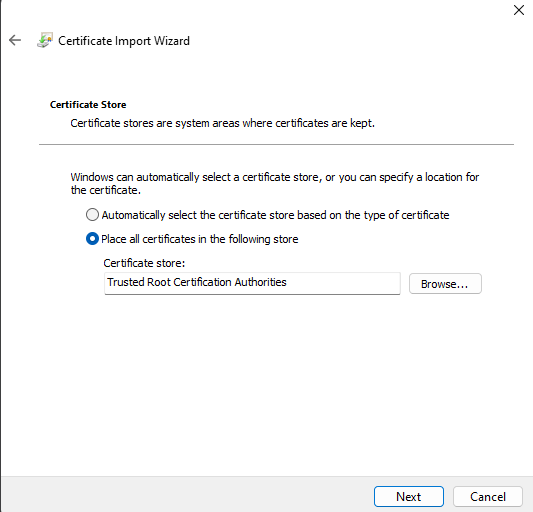
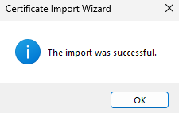

<a id="readme-top"></a>

<details>
  <summary>Table of Contents</summary>
  <ol>
    <li>
      <a href="#about-the-project">About The Project</a>
      <ul>
        <li><a href="#built-with">Built With</a></li>
      </ul>
    </li>
    <li>
      <a href="#getting-started">Getting Started</a>
      <ul>
        <li><a href="#prerequisites">Prerequisites</a></li>
        <li><a href="#installation">Installation</a></li>
      </ul>
    </li>
    
  </ol>
</details>


<!-- ABOUT THE PROJECT -->
## About The Project

We hope to create a platform where people can find volunteering and donation opportunities and get small rewards for their help. Users would be rewarded with points for their volunteering efforts and donations, where they can use these rewards to redeem some forms of incentives. Though these incentives would not be comparable to the efforts the users gave, it would still be a reward to the users. Through these, we hope to encourage more people to help those in need through donations and volunteering efforts.


### Built With

* [![React.js][React.js-logo]][React.js-url]
* [![Axios][Axios-logo]][Axios-url]
* [![Tailwind CSS][Tailwind-logo]][tailwind-url]


<!-- GETTING STARTED -->
# Getting Started

### Prerequisites (http only)

* npm
  ```sh
  npm install npm@latest -g
  ```
* Backend launched. Refer to the README.md in the <a href="https://github.com/g5-heapheaphooray/backEnd">Backend</a> repository.

### Installation
#### http
1. Clone the repo
   ```sh
   git clone https://github.com/g5-heapheaphooray/frontend.git
   ```
2. Install NPM packages
   ```sh
   npm clean install
   ```
3. Change into project directory
    ```sh
   cd heap
   ```
4. Launch frontend
    ```sh
   npm start
   ```

#### https
   
1. Clone the repo
   ```sh
   git clone https://github.com/g5-heapheaphooray/frontend.git
   ```
2. Go to Settings > Privacy and security > <a href="chrome://settings/security">Security</a> > Manage certificates in Chrome.

3. Go to Trusted Root Certification Authorities and click Import…



4. Click Next and then click Browse… to select the certificate you'd downloaded.




5. Go to the repository folder and find `frontend-cert.crt`. Use that as the certificate.



6. Click Next.


7. Check the option Place all certificates in the following stores and then click Next.



8. Click finish.


9. A Security Warning message pops up. Click Yes and then click OK to finish the import.




10. Repeat steps 2-9 but for `backend-cert.crt` as well.

11. Open the webpage <a href="https://101.44.162.159:3000">here</a>


<p align="right">(<a href="#readme-top">back to top</a>)</p>


<!-- CONTACT -->
## Contact

Project Link: https://github.com/g5-heapheaphooray/frontend

<p align="right">(<a href="#readme-top">back to top</a>)</p>


<!-- MARKDOWN LINKS & IMAGES -->
[React.js-logo]: https://img.shields.io/badge/React-20232A?style=for-the-badge&logo=react&logoColor=61DAFB
[React.js-url]: https://reactjs.org/
[Axios-logo]: https://img.shields.io/static/v1?style=for-the-badge&message=Axios&color=5A29E4&logo=Axios&logoColor=FFFFFF&label=
[Axios-url]: https://axios-http.com/
[Tailwind-logo]: https://img.shields.io/badge/tailwindcss-%2338B2AC.svg?style=for-the-badge&logo=tailwind-css&logoColor=white
[Tailwind-url]: https://tailwindcss.com/
